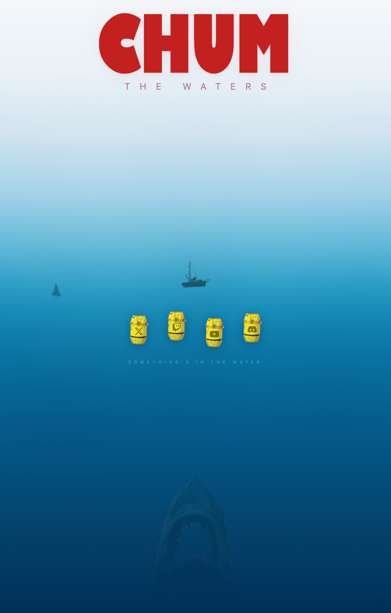

<p align="center">
  
  
  
  
</p>

<h1 align="center">Chum the Waters</h1>
<p align="center"><strong>Something's in the water.</strong></p>
<p align="center">
  <a href="https://chumthewaters.com">chumthewaters.com</a>
</p>

<p align="center">
  
</p>

---

## About

A *Jaws*-themed linktree page with full-scene ocean illustration. The entire page is a single animated underwater scene — sky-to-deep-ocean gradient, floating shark fin, a distant Orca boat silhouette, and a great white rising from the depths. Social links are styled as floating yellow barrels (the ones from the movie).

Built as a landing page for the "Chum" brand — linking out to Twitch, YouTube, X, and Discord.

## Features

- **Full-Scene Ocean Illustration** — Pure CSS gradient simulating sky, surface, and deep ocean with subtle radial light effects. No background images for the water itself.

- **Jaws Typography** — Custom `amity-jack.ttf` font (the iconic Jaws movie font) for the "CHUM" title, with wide-tracked "THE WATERS" subtitle.

- **Animated Shark Fin** — CSS-only shark fin that drifts across the surface with a realistic silhouette, appearing and disappearing.

- **Orca Boat Silhouette** — The fishing boat from Jaws, rendered as an inline SVG sitting on the waterline, gently bobbing.

- **Barrel Links** — Social media links styled as yellow floating barrels (Twitch, YouTube, X, Discord) with platform icons. They bob in the water with staggered CSS animations.

- **Rising Great White** — A shark image that lurks at the bottom of the viewport, emerging from the deep.

- **No Scroll, No JS** — The entire scene fits the viewport. Pure HTML/CSS animation, zero JavaScript.

## Assets

| File | Purpose |
|------|---------|
| `amity-jack.ttf` | Jaws movie font for the title |
| `barrel.png` | Yellow barrel sprite for link buttons |
| `boat.png` | Orca boat silhouette |
| `shark.png` | Great white rising from below |
| `shark-side.png` | Shark fin for surface animation |

## Tech Stack

| Layer | Technology |
|-------|-----------|
| Frontend | Vanilla HTML/CSS — single file, 729 lines |
| Font | Custom Jaws font (amity-jack.ttf) |
| Animations | Pure CSS keyframes — no JavaScript |
| Hosting | Cloudflare Pages |

## Project Structure

```
chumthewaters.com/
  index.html        # Full scene + links
  amity-jack.ttf    # Jaws font
  barrel.png        # Barrel link sprites
  boat.png          # Orca boat
  shark.png         # Rising great white
  shark-side.png    # Surface fin
  preview.png       # Screenshot for this README
  CLAUDE.md         # AI assistant context
  README.md         # You are here
```

## Deploy

```bash
wrangler pages deploy . --project-name=chumthewaters-com
```

## License

Private project. All rights reserved.
